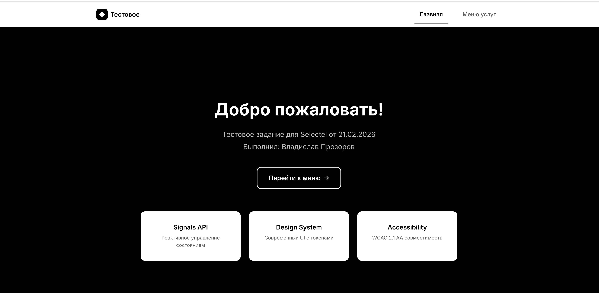
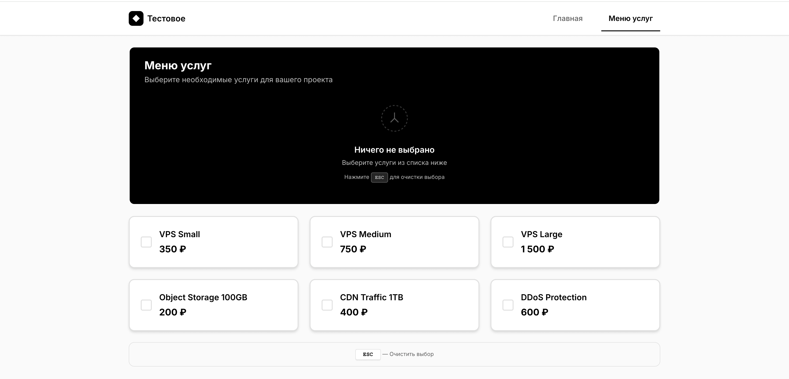
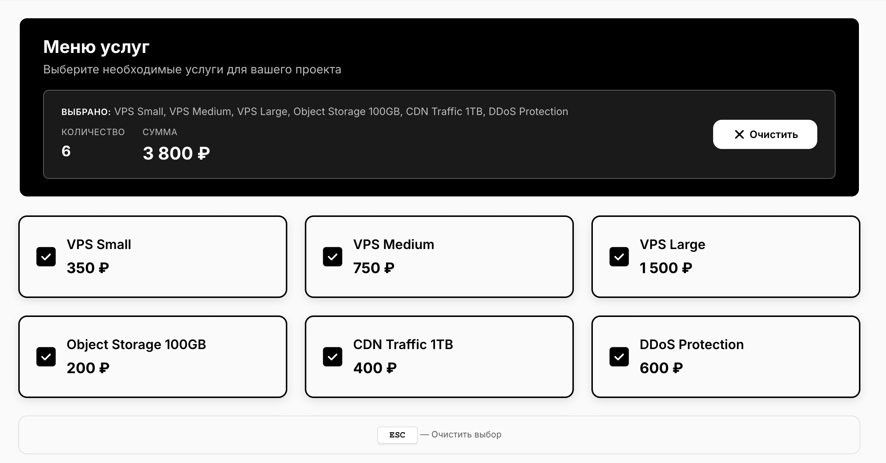
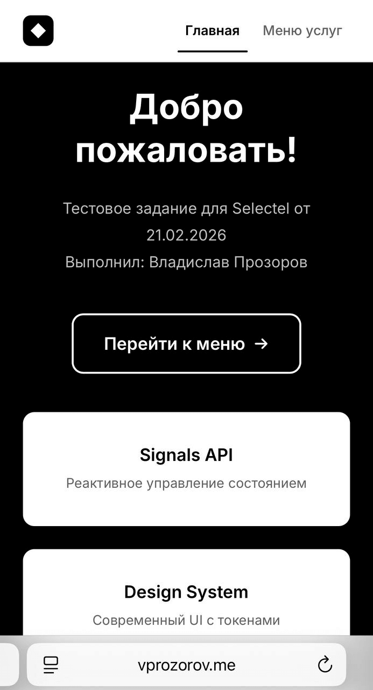

# Тестовое задание Selectel — Frontend-разработка

> **[Демо на GitHub Pages](https://vladislavprozorov.github.io/selectel-frontend-test/)**

[](https://github.com/vladislavprozorov/selectel-frontend-test/actions/workflows/ci.yml)

Двухстраничное веб-приложение для управления меню услуг с динамическим расчётом стоимости в монохромном минималистичном дизайне.

## Скриншоты

<table>
  <tr>
    <td align="center">
      
      <br />
      <sub><b>Страница приветствия</b></sub>
    </td>
    <td align="center">
      
      <br />
      <sub><b>Меню услуг</b></sub>
    </td>
  </tr>
  <tr>
    <td align="center">
      
      <br />
      <sub><b>Выбранные услуги с итоговой суммой</b></sub>
    </td>
    <td align="center">
      
      <br />
      <sub><b>Адаптивная мобильная версия</b></sub>
    </td>
  </tr>
</table>

## Описание проекта

### Реализованный функционал

**Обязательные требования:**

- Две страницы: приветствие и меню услуг
- Навигация между страницами
- Список услуг с checkbox и ценами
- Динамический заголовок с выбранными элементами, количеством и общей суммой
- Размещение на GitHub Pages

**Дополнительный функционал:**

- **Кастомная монохромная дизайн-система** — минималистичный черно-белый дизайн
- Сохранение выбранных услуг в localStorage
- Сброс выбранных элементов (кнопка + горячая клавиша ESC)
- Полное покрытие unit-тестами (48 тестов)
- CI/CD pipeline с автоматическим деплоем
- Accessibility (ARIA, keyboard navigation)
- Форматирование валюты по русской локали

## Технологический стек

### Основной стек

- **Angular**: 19.1.5
- **TypeScript**: 5.7.3
- **Vitest**: 4.0.18 (тестирование)
- **Biome**: 1.9.4 (линтинг и форматирование)

### Инструменты разработки

- **Husky**: pre-commit хуки
- **lint-staged**: автопроверка перед коммитом
- **commitlint**: conventional commits
- **@analogjs/vite-plugin-angular**: интеграция Angular + Vitest

### CI/CD

- **GitHub Actions**: автоматизация сборки и деплоя
- **GitHub Pages**: хостинг приложения
- **Codecov**: отчёты о покрытии тестами

## Структура проекта

```
selectel-test/
├── .github/
│   └── workflows/
│       └── ci.yml              # CI/CD pipeline
├── src/
│   ├── app/
│   │   ├── features/
│   │   │   ├── welcome/        # Страница приветствия
│   │   │   │   ├── welcome.component.ts
│   │   │   │   ├── welcome.component.spec.ts
│   │   │   │   ├── welcome.html
│   │   │   │   └── welcome.css
│   │   │   └── menu/           # Страница меню услуг
│   │   │       ├── menu.component.ts
│   │   │       ├── menu.component.spec.ts
│   │   │       ├── menu.component.html
│   │   │       ├── menu.component.scss
│   │   │       ├── data/       # Статичные данные услуг
│   │   │       └── models/     # TypeScript интерфейсы
│   │   ├── layout/
│   │   │   └── header/         # Навигационный хедер
│   │   ├── shared/
│   │   │   ├── design-system/  # CSS переменные и токены
│   │   │   └── utils/          # Утилиты (formatCurrency)
│   │   ├── app.ts              # Root компонент
│   │   ├── app.routes.ts       # Роутинг
│   │   └── app.config.ts       # Конфигурация приложения
│   ├── index.html
│   ├── main.ts
│   └── styles.css              # Глобальные стили
├── angular.json                # Конфигурация Angular CLI
├── vitest.config.ts            # Конфигурация тестов
├── biome.json                  # Правила линтера
├── tsconfig.json               # TypeScript конфигурация
└── package.json
```

## Установка и запуск

### Требования

- Node.js 20.x или выше
- npm 10.x или выше

### Установка зависимостей

```bash
npm install
```

### Запуск в режиме разработки

```bash
npm start
```

Приложение будет доступно по адресу: http://localhost:4200

### Сборка для production

```bash
npm run build
```

Результат сборки находится в папке `dist/selectel-test/browser/`

### Запуск тестов

```bash
npm test
```

### Запуск тестов с покрытием

```bash
npm test -- --coverage
```

### Линтинг

```bash
npm run lint
```

### Автоисправление линтера

```bash
npm run lint:fix
```

## CI/CD Pipeline

### Этапы автоматизации

1. **Lint Code**: проверка кода на соответствие стандартам
2. **Run Tests**: запуск unit-тестов с генерацией coverage
3. **Build Application**: сборка production версии
4. **Deploy to GitHub Pages**: автоматический деплой на main ветку

### Защита main ветки

Настроены Branch Protection Rules:

- Запрещён прямой push в main
- Обязательно создание Pull Request
- Обязательное прохождение всех CI проверок
- Автоматический деплой только после успешного мерджа

### Workflow запускается при:

- Push в ветки: `main`, `develop`, `feature/*`
- Создании Pull Request в `main` или `develop`

## Архитектурные решения

### Управление состоянием

- **Signals API** (Angular 19): реактивное управление состоянием
- **Computed signals**: автоматический пересчёт при изменениях
- **Effect**: автосохранение в localStorage

### Стилизация

- **Monochrome Design System**: минималистичная черно-белая палитра
- **CSS Custom Properties**: централизованная дизайн-система
- **TypeScript Design Tokens**: типизированные значения цветов, отступов, шрифтов
- **SCSS модули**: изолированные стили компонентов
- **Адаптивная вёрстка**: mobile-first подход
- **Smooth Transitions**: плавные анимации и hover-эффекты

### Оптимизации

- **OnPush Change Detection**: минимизация перерисовок
- **Standalone Components**: tree-shaking и уменьшение bundle
- **Lazy Loading**: отложенная загрузка маршрутов
- **Path Aliases**: чистые импорты (@shared, @features, @core)

### Тестирование

- **Unit тесты**: 48 тестов с полным покрытием
- **Component Testing**: изолированное тестирование компонентов
- **Mock localStorage**: стабильные тесты без внешних зависимостей
- **Snapshot Testing**: проверка структуры DOM

## Особенности дизайна

- **Монохромная палитра**: минималистичный черно-белый дизайн в стиле Yandex Practicum
- **Плавные переходы**: все интерактивные элементы с transition
- **Hover-эффекты**: инвертированные цвета при наведении на кнопки
- **Типографика**: четкая иерархия размеров и межстрочных интервалов
- **Тени**: мягкие тени для создания глубины без цветных акцентов
- **Адаптивность**: корректное отображение на всех разрешениях

## Демо

Приложение развёрнуто на GitHub Pages:
https://vladislavprozorov.github.io/selectel-frontend-test/

## Команды разработки

| Команда            | Описание            |
| ------------------ | ------------------- |
| `npm start`        | Запуск dev-сервера  |
| `npm run build`    | Production сборка   |
| `npm test`         | Запуск тестов       |
| `npm run lint`     | Проверка кода       |
| `npm run lint:fix` | Автоисправление     |
| `npm run format`   | Форматирование кода |

## Автор

Владислав Прозоров

## Лицензия

MIT
